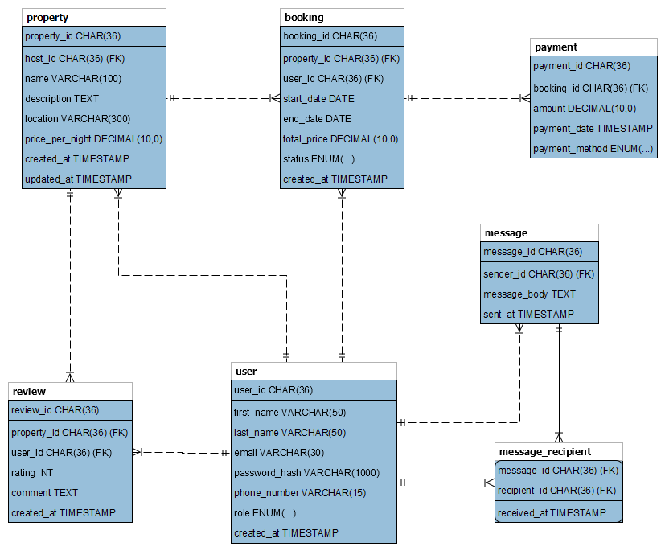

   
  <h1><b>alx-airbnb-database</b></h1>

 

---
## Table of Contents

- [Table of Contents](#table-of-contents)
- [Introduction](#introduction)
- [Database Structure](#database-structure)

 

---

**`Fig. AirBnB Entity - Relationship Diagram`**

 

---
## Introduction

This project is a demonstration of how one might create a database model for a platform similar to Airbnb. It includes tables for managing users, properties, hosts, bookings, transactions, reviews, amenities, and their relationships. The database schema allows for basic functionalities such as user registration, property listing, booking management, transaction handling, and review submission.

## Database Structure

The database structure consists of the following tables:

- `user`: Stores information about users registered on the platform.
- `property`: Contains details of properties available for booking.
- `property_feature`: Contains details of amenities available for properties.
- `booking`: Stores booking details made by users for properties.
- `payment`: Stores payment records related to bookings.
- `review`: Stores reviews submitted by users for properties.
- `message`: Stores messages sent by users for other user.
- `message_recipient`: Stores records of recipient(s) a user sent messages.
