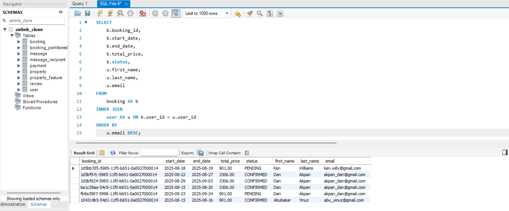
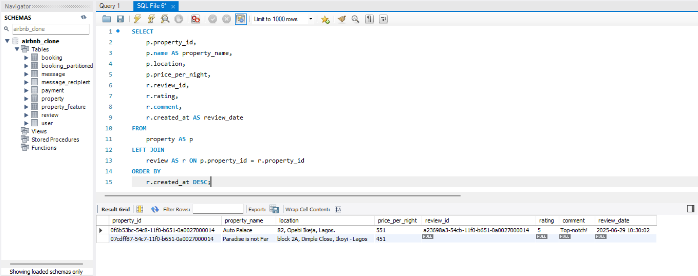
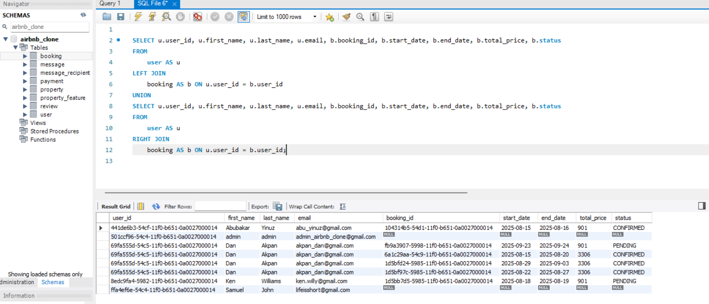

   
  <h1><b>alx-airbnb-database</b></h1>
  <h2><i>advanced-script</i></h2>

 

---
## Table of Contents

- [Table of Contents](#table-of-contents)
  - [Objectives](#objectives)
  - [Complex Queries with Joins](#complex-queries-with-joins)
  - [Subqueries](#subqueries)
  - [Aggregations and Window Functions](#aggregations-and-window-functions)
  - [Implement Indexes for Optimization](#implement-indexes-for-optimization)
    - [Indexing](#indexing)
  - [Aggregations and Window Functions](#aggregations-and-window-functions-1)

 

---

### Objectives

This document details the implementation of advanced SQL querying and optimization techniques for a simulated Airbnb database, ensuring you are equipped to handle large-scale applications where efficiency and scalability are critical.

 

---

### Complex Queries with Joins

- Query using an **`INNER JOIN`** to retrieve all bookings and the respective users who made those bookings.

 

- Query using a **`LEFT JOIN`** to retrieve all properties and their reviews, including properties that have no reviews.

 

- Query using a **`FULL OUTER JOIN`** to retrieve all users and all bookings, even if the user has no booking or a booking is not linked to a user.
  
  - **Note**: While MySQL does not natively support **`FULL OUTER JOIN`**,this functionality can be achieved by using **`UNION`** to combine separate **`LEFT JOIN`** and **`RIGHT JOIN`** queries.

 

---

### Subqueries

- Query to find all properties where the average rating is greater than 4.0 using a subquery.

 

- A correlated subquery to find users who have made more than 3 bookings.

 

---

### Aggregations and Window Functions

- Query to find the total number of bookings made by each user, using the COUNT function and GROUP BY clause.

 

- A query using window function (ROW_NUMBER, RANK) to rank properties based on the total number of bookings they have received.

 

---

### Implement Indexes for Optimization

#### Indexing

- **`Primary Keys`**: Indexed automatically.
- **`Additional Indexes`**:
    - **`email`** in the `User` table.
    - `FullText index` on **`location`** in the `Property` table.
    - **`amenity`** in the `Property_Feature` table.
    - **`property_id`** in the `Property_Feature`, and `Booking` tables.
    - **`booking_id`** in the `Booking` and `Payment` tables.

 

---

### Aggregations and Window Functions

- Query to find the total number of bookings made by each user, using the COUNT function and GROUP BY clause.

 

- A query using window function (ROW_NUMBER, RANK) to rank properties based on the total number of bookings they have received.

 

