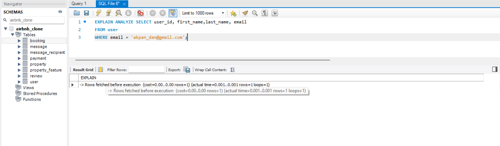
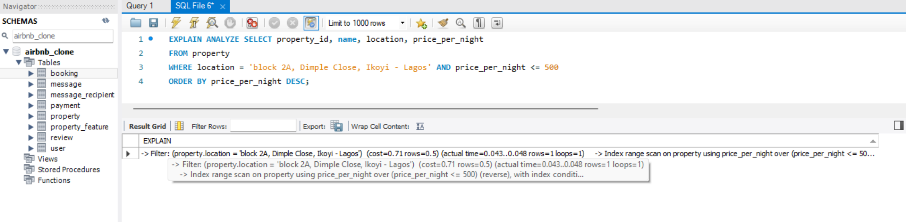
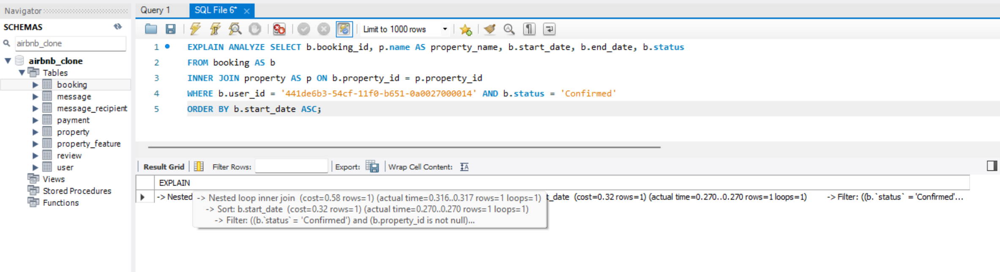

<div align="center">
  <br>
  <h1><b>alx-airbnb-database</b></h1>
  <h2><i>advanced-script</i></h2>
</div>
<br />

---
## Table of Contents

- [Table of Contents](#table-of-contents)
  - [Objectives](#objectives)
  - [Implement Indexes for Optimization](#implement-indexes-for-optimization)
      - [High Usage Columns:](#high-usage-columns)
  - [Creating appropriate indexes for the tables](#creating-appropriate-indexes-for-the-tables)
      - [Query Tested - Before Indexes:](#query-tested---before-indexes)
      - [After Indexes:](#after-indexes)


<br />

---

### Objectives

This document details the implementation of advanced SQL querying and optimization techniques for a simulated Airbnb database, ensuring you are equipped to handle large-scale applications where efficiency and scalability are critical.

This aims to assess and compare query performance, pre- and post-indexing, with particular attention to operations involving `user_id`, `property_id`, `start_date`, and `status` within the `booking` table, and `email` within the `user` table.


<br />

---

### Implement Indexes for Optimization

##### High Usage Columns: 
  - **`Primary Keys`**: 
    - **`user_id`** in the `user` table.
    - **`property_id`** in the `property` table.
    - **`property_id`** plus **`amenity`** in the `property_feature` table.
    - **`booking_id`** in the `booking` table.
  - **`Additional Indexes`**:
    - **`email`** in the `user` table.
    - `FullText index` on **`location`**, **`host_id`**, and **`price_per_night`**  in the `property` table.
    - **`user_id`**, **`start_date`**, and **`status`** in the `booking` 
    - **`amenity`** in the `property_feature` table.


<br />

---

###  Creating appropriate indexes for the tables

- **`Primary Keys`**: Indexed automatically.
- **`Foreign Keys`**: 
  - **`host_id`**  in the `property` table.
  - **`amenity`** in the `property_feature` table.
  - **`user_id`** and **`property_id`** in the `booking`
- **`Additional Indexes`**:
    - **`email`** in the `user` table.
    - `FullText index` on **`location`**, and **`price_per_night`**  in the `property` table.
    - **`start_date`**, and **`status`** in the `booking` table.


<br />

##### Query Tested - Before Indexes: 

- `query 1`

```sql
--- Find users with a specific email
EXPLAIN ANALYZE SELECT user_id, first_name,last_name, email
FROM user
WHERE email = 'akpan_dan@gmail.com';
```




**Problem:** Without supporting indexes for `email`, MySQL performed an expected, inefficient, and costly full table scan to find matching rows, especially at scale. This significantly degraded performance as the user table grew.

Observing query patterns, additional indexes were created. For example, authentication relies on both `email` and `password_hash`, while user authorization depends heavily on the `role` column. These insights guided the creation of specific indexes to optimize these frequent operations.

**Solution:** For optimized query performance, the following indexes were created:

```sql
-- Indexes for the 'user' table

-- Index on 'role' for efficient filtering of users by their role
CREATE INDEX idx_user_role ON user (role);

-- Index on 'email' for efficient filtering of users by their email
CREATE INDEX idx_user_email ON user (email);

-- Index on 'password_hash' for efficient filtering of users by their email
CREATE INDEX idx_password_hash ON user (password_hash);
```
<br />

- `query 2`

```sql
--- Find properties in a specific location within a price range
EXPLAIN ANALYZE SELECT property_id, name, location, price_per_night
FROM property
WHERE location = 'block 2A, Dimple Close, Ikoyi - Lagos' AND price_per_night <= 500
ORDER BY price_per_night DESC;
```



**Problem:** Without supporting indexes for `location` and `price_per_night`, MySQL performed an expected, inefficient, and costly full table scan to find matching rows, especially at scale. This significantly degraded performance as the user table grew.

Also, observing query patterns on the `property` table, additional indexes were created. For example, searching properties based on property name or amenities/features depended on the property `name` or `amenity` column by joining the `property_feature` table on `property_id`.

**Solution:** For optimized query performance, the following indexes were created:

```sql

--
-- Indexes for the 'property' table

-- Index on 'host_id' to optimize joins with the 'user' table (for host properties)
CREATE INDEX idx_property_host_id ON property (host_id);

-- Index on 'price_per_night' for efficient filtering and ordering by price
CREATE INDEX idx_property_price_per_night ON property (price_per_night);

-- Index on 'name' for faster lookups or filtering by property name
CREATE INDEX idx_property_name ON property (name);

--
-- Indexes for the 'property_feature' table

-- Index on 'amenity' for faster lookups or filtering by property feature
CREATE INDEX idx_property_amenity ON property_feature (amenity);

CREATE INDEX idx_property_id ON property_feature (property_id);
```

<br />

- `query 3`

```sql
--- Find all confirmed bookings for a specific user
EXPLAIN ANALYZE SELECT b.booking_id, p.name AS property_name, b.start_date, b.end_date, b.status
FROM booking AS b
INNER JOIN property AS p ON b.property_id = p.property_id
WHERE b.user_id = '441de6b3-54cf-11f0-b651-0a0027000014' AND b.status = 'Confirmed'
ORDER BY b.start_date ASC;
```



**Problem:** Without supporting indexes on required columns in table `user`, `property`, and `booking`, MySQL performed an expected, inefficient, and costly full table scan to find matching rows, especially at scale. This significantly degraded performance as the user table grew.

**Solution:** For optimized query performance, the following indexes were created on `booking` table:

```sql
--
-- Indexes for the 'booking' table

-- Index on 'property_id' to optimize joins with the 'property' table
CREATE INDEX idx_booking_property_id ON booking (property_id);

-- Index on 'user_id' to optimize joins with the 'user' table
CREATE INDEX idx_booking_user_id ON booking (user_id);

-- Index on 'start_date' and 'end_date' for efficient date range queries (e.g., availability checks)
CREATE INDEX idx_booking_start_date ON booking (start_date);

-- Index on 'start_date' and 'end_date' for efficient date range queries (e.g., availability checks)
CREATE INDEX idx_booking_dates ON booking (start_date, end_date);

-- Index on 'status' for filtering bookings by their status
CREATE INDEX idx_booking_status ON booking (status);

-- Index on 'user, property, status' for filtering bookings by their status
CREATE INDEX idx_user_property_status (user_id, property_id, status)
```

<br />


**Performance Observation**
- **Execution Plan:** MySQL performed a full table scan (type: ALL) to retrieve matching rows.
- **Cost:** Despite the date range, the optimizer performed a full scan, evaluating every row in the booking table.
- **Scalability Concern:** This approach is inefficient for large or growing datasets.

<br />

---


##### After Indexes: 
**Observations**

After recreating the indexes and rerunning the tests, a noticeable improvement in query performance was observed. Queries that previously relied on full table scans were now efficiently resolved using index lookups. 

This strategic shift significantly reduced the number of rows examined during execution and, consequently, lowered the overall query cost, leading to much faster data retrieval.

<br />

- `query 1`

The query benefited from `idx_user_email`.

- `query 2`

The query benefited from the full-text index `location` (if it were a standard index) and `idx_property_price_per_night` indexes.

- `query 3`

The query benefited from `idx_booking_property_id`, `idx_booking_user_id`, `idx_booking_start_date`, and `idx_booking_status` indexes

<br />


