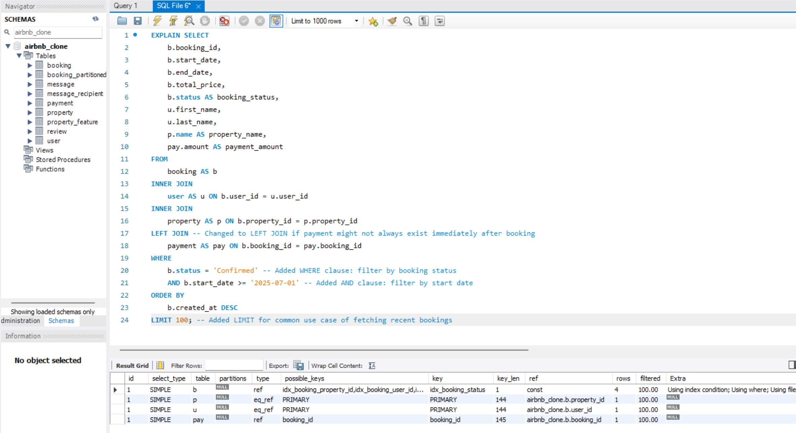
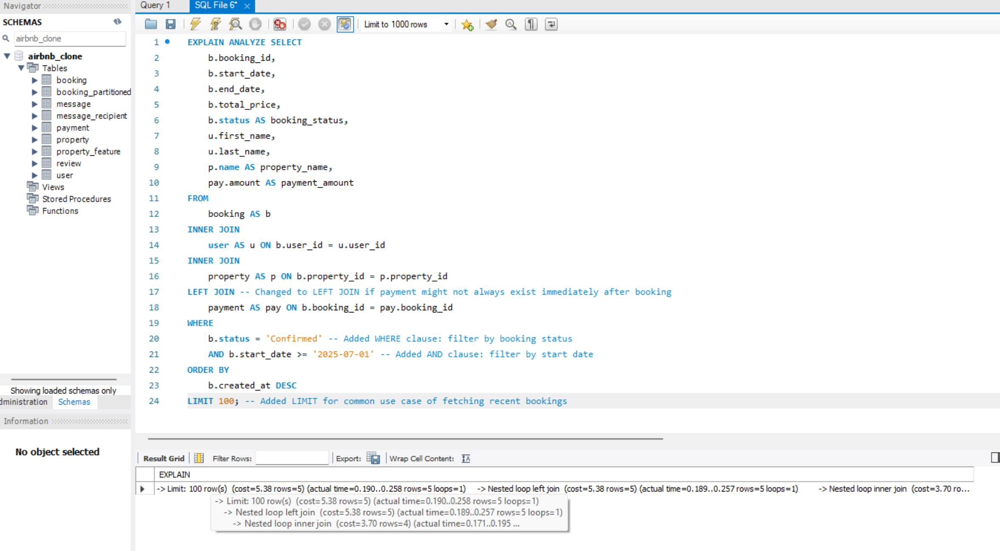

   
  <h1><b>alx-airbnb-database</b></h1>
  <h2><i>Optimize Complex Queries</i></h2>

 

---
## Table of Contents

- [Table of Contents](#table-of-contents)
  - [Objectives](#objectives)
  - [Optimize Complex Queries](#optimize-complex-queries)

 

---

### Objectives

This document details the refactoring of complex queries for performance improvement.

 

---

### Optimize Complex Queries

-  initial query that retrieves all bookings along with the user details, property details, and payment details 

 

  [ [↑ to top ↑](#table-of-contents) ]

- Analyze the query’s performance using EXPLAIN to identify any inefficiencies.

`using EXPLAIN`

`using EXPLAIN ANALYZE`

 

  [ [↑ to top ↑](#table-of-contents) ]

- After refactoring the query to reduce execution time, such as by reducing unnecessary joins or using.
  

`using EXPLAIN`

`using EXPLAIN ANALYZE`

 

  [ [↑ to top ↑](#table-of-contents) ]

