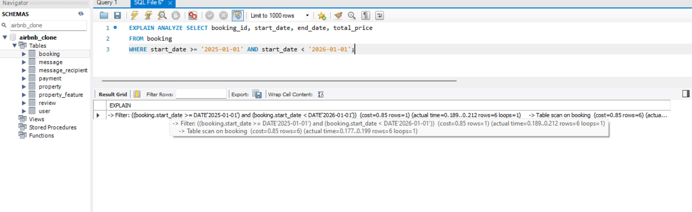
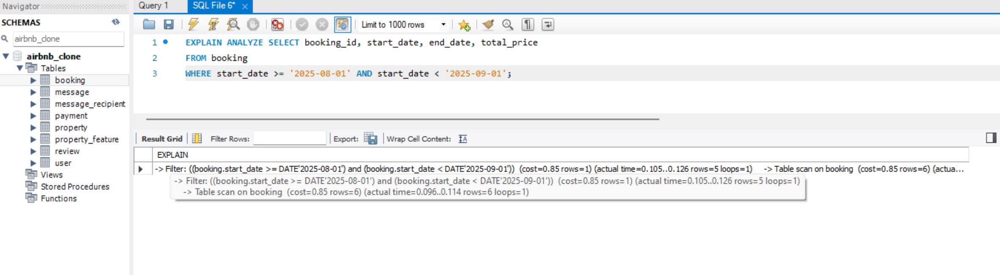
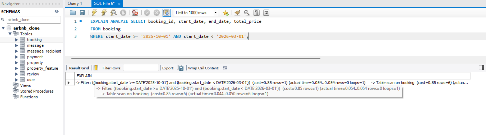
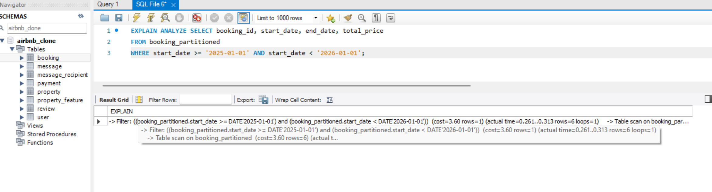
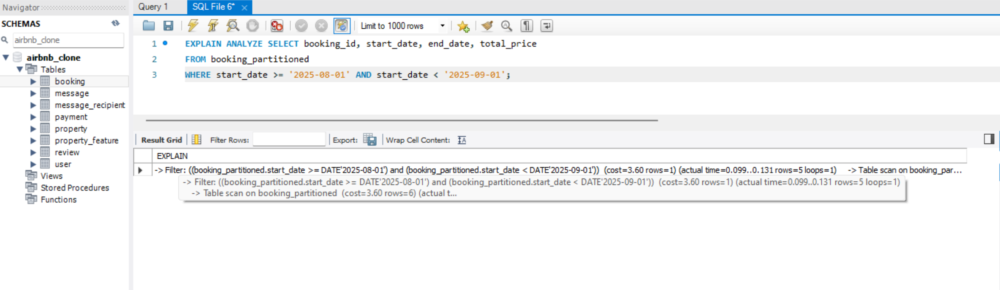
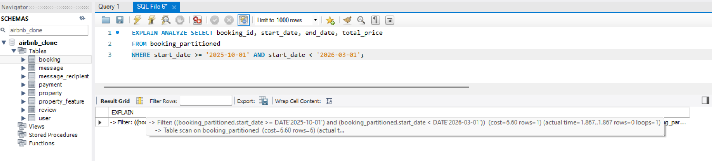

<div align="center">
  <br>
  <h1><b>alx-airbnb-database</b></h1>
  <h2><i>advanced-script</i></h2>
</div>
<br />

---
## Table of Contents

- [Table of Contents](#table-of-contents)
  - [Objectives](#objectives)
  - [Before Partitioning](#before-partitioning)
  - [After Partitioning](#after-partitioning)


<br />

---

### Objectives

This document details the implementation of table partitioning to optimize queries on large datasets.

This analysis compares query performance on the booking table, evaluating the impact of date-based partitioning on query efficiency, particularly for date-range filters.

<br />

---

### Before Partitioning

**Query Tested on `booking` table**

- `query 1`

```sql
EXPLAIN ANALYZE SELECT booking_id, start_date, end_date, total_price
FROM booking
WHERE start_date >= '2025-01-01' AND start_date < '2026-01-01';
```




<br />

- `query 2`

```sql
EXPLAIN ANALYZE SELECT booking_id, start_date, end_date, total_price
FROM booking
WHERE start_date >= '2025-08-01' AND start_date < '2025-09-01';
```



<br />

- `query 3`

```sql
EXPLAIN ANALYZE SELECT booking_id, start_date, end_date, total_price
FROM booking
WHERE start_date >= '2025-10-01' AND start_date < '2026-03-01';
```



<br />

**Performance Observation**
- **Execution Plan:** MySQL performed a full table scan (type: ALL) to retrieve matching rows.
- **Cost:** Despite the date range, the optimizer performed a full scan, evaluating every row in the booking table.
- **Scalability Concern:** This approach is inefficient for large or growing datasets.

<br />

---
### After Partitioning

**Partitioning Setup**

The `bookings_partitioned` table now uses `RANGE` partitioning on `start_date` (yearly boundaries). A composite primary key (`booking_id`, `start_date`) was required by MySQL; original indexes remain for efficiency.

**Query Tested on `booking` table**

- `query 1`

```sql
EXPLAIN ANALYZE SELECT booking_id, start_date, end_date, total_price
FROM booking_partitioned
WHERE start_date >= '2025-01-01' AND start_date < '2026-01-01';
```




<br />

- `query 2`

```sql
EXPLAIN ANALYZE SELECT booking_id, start_date, end_date, total_price
FROM booking_partitioned
WHERE start_date >= '2025-08-01' AND start_date < '2025-09-01';
```



<br />

- `query 3`

```sql
EXPLAIN ANALYZE SELECT booking_id, start_date, end_date, total_price
FROM booking_partitioned
WHERE start_date >= '2025-10-01' AND start_date < '2026-03-01';
```



<br />

**Performance Observation**
- **Execution Plan:** The MySQL optimizer effectively leveraged partition pruning, thereby restricting scan operations exclusively to partitions satisfying the range predicate.
- **Access Type:** The database optimized query execution by scanning only the pertinent data segments, thereby significantly reducing unnecessary I/O operations.
- **Improvement:** Enhanced query performance, with substantially reduced row scanning.

<br />

---

**Performance Observation**
When executing the provided queries on a Booking table that has been partitioned by start_date (as per the CREATE TABLE statement in the Canvas), you would observe significant **performance improvements**, primarily due to partition pruning.

<br />

**Summary:**

**Test Query 1 (Specific Year):** This query, filtering for `start_date` within `'2025-01-01'` and `'2026-01-01'`, would show that the database optimizer only scans the `p2025` partition. This dramatically reduces the amount of data the database needs to read and process, leading to much faster query execution compared to scanning the entire large Booking table.

**Test Query 2 (Specific Month within a Year):** Similarly, this query (filtering for `August 2025`) would also benefit from partition pruning, narrowing the search down to the `p2025` partition first, and then applying the more granular date filter within that smaller dataset. This is still much faster than a full table scan.

**Test Query 3 (Spanning Multiple Years):** For queries that span across partition boundaries (e.g., `late 2025` to `early 2026`), the database would intelligently identify and scan only the relevant partitions (e.g., `p2025` and `p2026`). While it scans more than one partition, it still avoids scanning all other irrelevant partitions, resulting in a performance gain over a non-partitioned table.

In summary, partitioning the Booking table by start_date allows the database to efficiently narrow down the search space for date-range queries, leading to faster response times and reduced I/O operations.
