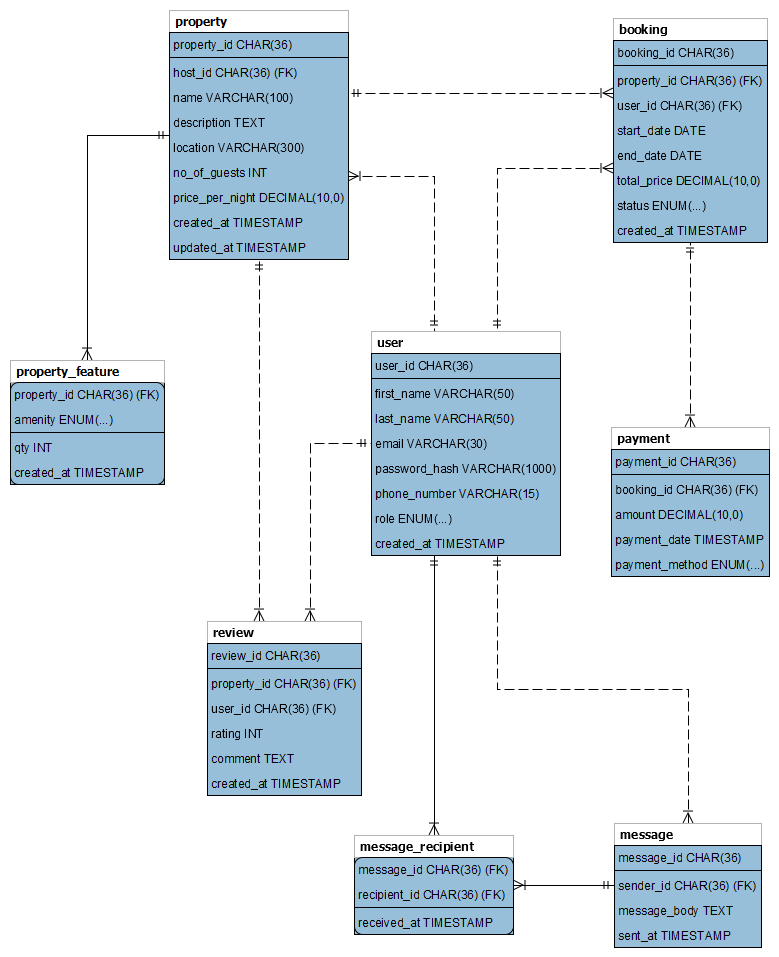

   
  <h1><b>AirBnB Clone</b></h1>
  <strong>...The Airbnb Clone Project Blueprint</strong>

---

---

 

### Database Specification - AirBnB

 

#### Normalized Entity and Attributes

It's expected that users will send messages to multiple recipients. Creating a separate table removes the transitive dependency from the recipient to the sender, thus ensuring better data integrity. 

---

#### Message

- **`message_id`**: Primary Key, UUID, Indexed
- **`sender_id`**: Foreign Key, references User(user_id)
- **`message_body`**: TEXT, NOT NULL
- **`sent_at`**: TIMESTAMP, DEFAULT CURRENT_TIMESTAMP

#### Message_Recipient

- **`message_id`**: Foreign Key, references Message(message_id)
- **`recipient_id`**: Foreign Key, references User(user_id)
- **`received_at`**: TIMESTAMP, DEFAULT CURRENT_TIMESTAMP

---
#### Constraints
---

#### Message Table

- **`Foreign key`** constraints on `sender_id` 

#### Message_Recipient

- **`Foreign key`** constraints on each `message_id` and `recipient_id`.
- **`Composite Primary key`** constraints on `message_id` and `recipient_id`.